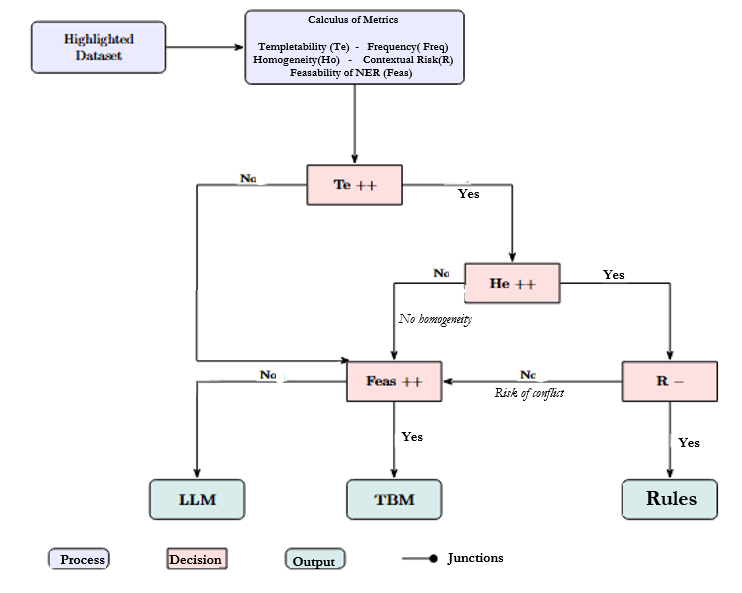

# DuraXELL: Sustainable Information Extraction for LLMs in Oncology

[](https://github.com/longeacc/DEMNE-Determination-of-Extraction-Methode-for-Named-Entity/actions/workflows/ci.yml)
[](LICENSE)
[](https://python.org)

DuraXELL is a medical information extraction pipeline (biomarkers) designed to optimise the **Trilemma: Performance, Explainability, Frugality**. Rather than systematically relying on energy-intensive LLMs, DuraXELL uses a decision tree to route each entity to the lightest extraction method possible (Rules > ML > Transformer > LLM).

## Decision Tree Architecture


*Decision Tree for Optimal Named-Entity Extraction Method Selection*

## Main Results (Pareto Front)


## Installation and Reproducible Execution

1. **Clone the repository**:

   ```bash
   git clone https://github.com/longeacc/DEMNE-Determination-of-Extraction-Methode-for-Named-Entity.git
   cd DuraXELL
   ```

2. **Create a virtual environment and install dependencies**:

   ```bash
   python -m venv .venv
   source .venv/bin/activate  # On Windows: .venv\Scripts\activate
   pip install -e .[dev,ner]
   ```

3. **Run the full pipeline**:
   Open and execute the master notebook:

   ```bash
   jupyter notebook Reports/DuraXELL_Pipeline.ipynb
   ```

   Or run the report script:

   ```bash
   python scripts/run_full_pipeline_report.py
   ```

## References and Citation

This work builds on research by **Akram REDJDAL et al. 2024** on information extraction in oncology and the evaluation of language model frugality.

**Citation:**
> Akram REDJDAL et al. 2024. *The right use of LLMs and NLP methods in oncology: Towards a frugal and explainable approach*. ESIEE Paris.
